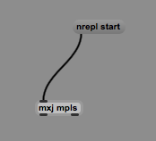
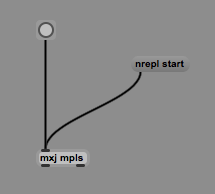
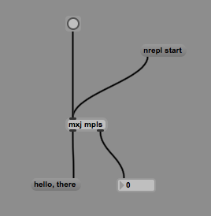

# mpls

Live-code Max and Max4Live with Clojure.


## Prereqs

- Leiningen (http://leiningen.org/)
- Max (https://cycling74.com/products/max/)
  or  
- Max for Live (https://www.ableton.com/en/live/max-for-live/)

## Setting Up

Download [mpls.jar](https://drive.google.com/file/d/0B36VehDQ2W3od1hRV1E5M2ZaSEU/view?usp=sharing) and copy it into the java lib folder for Max.

Mac: `/Applications/Max 6.1/Cycling '74/java/lib/`  
Windows: TODO  
Linux: TODO  

### Doing Stuff

Launch Max/Max4Live and create an `mxj mpls` object.

(If you get the error message "Could not load class 'mpls'", double-check where you put your `mpls.jar`.)

Create a `nrepl start` message box and connect it to your `mxj mpls` box.



Exit edit mode and click your `nrepl start` object.

You should see a message that says `nrepl server running on port [port]`

Open a term and enter

```
lein repl :connect localhost:[port]
```

using `port` from above.

You should now have a Clojure repl.

_While a repl is a fine place to start, you'll eventually want to move your workflow to an nrepl-supporting text editor. Emacs, Vim, Light Table, Sublime, IntelliJ, and Eclipse are all good options. For Emacs, Cider is supported with cider-nrepl v0.9.0-SNAPSHOT._

Test it out

```clj
(+ 1 1)
```

Still 2? Good.

Import some stuff

```clj
(require '[mpls :refer :all])
```

Do your first thing.

```clj
(post "Here I am!")
```

If your Max logging window is open (Max > Window > Max Window), you'll hopefully see `Here I am!` printed there.

Now create a `bang` object and connect it to `mpls`.



Now bang it!

You should see something like `/bang unimplemented` in the Max window. Let's fix that.

Announce yourself.

```clj
(hello-mpls!)
```

> If you're the curious sort, `hello-mpls!` tells `mpls` to find callback functions for inlet messages in the current namespace. One such function is the `bang` function, which will fire whenever `mpls` gets a `bang` message.

Now define a function called `bang`.

```clj
(defn bang [inlet] (post "pew! pew! pew!"))
```

Bang it again! Congratulations, you're live-coding Max.

## Outlets

Send a message to an outlet like this:

```clj
(out "message")
```

To see your message, create a message box, wire the first outlet of `mxj mpls` to the second inlet of the message box, then do


```clj
(out "hello out there")
```

Connect the second outlet to an integer box. Then try



```clj
(out 1 1024)
```

And this

```clj
(dotimes [i 1000] (out 1 i))
```

## Tying it together

```clj
(def n (atom 0))
(defn bang [inlet] (out 1 (swap! n inc)))
```

Bang away!

## Other messages

You've seen `bang`, which responds to bangs on the inlet. There is also `int-msg` for ints, `float-msg` for floats, `list-msg` for lists, `dblclick` for mousey things, and `msg` for everything else.

`bang` and `dblclick` take one arguments:the 0-indexed inlet number. `list-msg` and `msg` take two arguments: inlet and a vector of args. `int-msg` and `float-msg` take two arguments: inlet and a number.

Messages sent to `mpls` for message boxes trigger `msg` calls with a vector of their space-delimited contents. An example to illustrate:

Create a message box with the text "reset", then

```clj
(defn msg [inlet [command]]
  (when (= command "reset")
    (do
      (reset! n 0)
      (out 1 @n))))
```

Lets specify what to reset to. Connect another message box "reset 234"

```clj
(defn msg [inlet [command i]]
  (when (= command "reset")
    (do
      (reset! n (or i 0))
      (out 1 @n))))
```

## Programmatic layout

You're probably pretty tired of creating all these bangs and message boxes by hand, huh.

Try this

```clj
(def my-button
  (mnew "button" 200 200))
```

So much easier, right? Well how about this

```clj
(for [i (range 100)] (mnew "button" (* i 10) 200))
```

Whoa, right. Now go delete them all one-by-one.

Once that's done, it's probably better to assign your creations so you can refer to them later.

```clj
(def buttons (for [i (range 100)] (mnew "button" (* i 10) 200)))
```

What huh? Didn't work. Or did it?

```clj
(doall buttons)
```

There they are! Clojure's `for` is lazy and entries are not realized until asked for. `doall` forces realization (as does printing to the repl, which is why it worked when we didn't assign the buttons to a var).

You could also wrap the `for` statement in `doall` before assigning to `buttons`.

Okay, now let's delete them. We use `mremove`:

```clj
(map mremove buttons)
```

Pretty neat, huh.

`map` is also lazy, FYI. It works without `doall` only because the repl realizes the results to print them out. Also, it's not really supposed to be used for side-effecting operations like `mremove`. You _should_ be using `doseq`.

```clj
(doseq [b buttons] (mremove b))
```

But `(map mremove buttons)` is just so terse and cool.

## Connecting things

Still connecting objects with a mouse? For shame.

```clj
(def button (mnew "button" 200 200))

(connect button 0 box 0)
```

And disconnect

```clj
(disconnect button 0 box 0)
```

## Cast of characters

Who's this `box` character? It's the the box that encloses `mxj mpls`. In Max we connect boxes, which are all subclasses of `MaxBox` in java extensions. (`mpls` just wraps the java API in Clojure.)

Want to know more about `MaxBox`es? You'll want to read the java API.

Mac: /Applications/Max [version]/java-doc/api/index.html  
Windows: TODO  
Linux: TODO  

You also have access to a few others

- mpls : MaxObject - The custom java subclass of `MaxObject` that does all these nice things for us
- box : MaxBox - The box enclosing `mpls`
- patcher : MaxPatcher - the patcher 
- window : MaxWindow - the window

## Warning! Warning!

Now that you've been looking at the API, you're in a great position to crash Max hard. See, Max operates in a couple of different threads, and some threads don't like some operations. As in, call these ops in the wrong thread and Max gracefully dies on the spot.

When creating a traditional java extension, you wouldn't worry too much about this, because the methods you define are generally called for you in the proper context.

However, when we're live-coding, we're crashing our cart right through those guardrails. While I've taken some care to prevent Max-crashing operations in the mpls API, there are no such accommodations when calling the java API directly.

For example, creating graphical objects using the java API directly from the repl will crash Max:

```clj
;; DON'T DO THIS (except for educational purposes)
(.newDefault patcher 200 200 "button" nil)
;; CRASH!
```

How do we circumvent this catastrophe? The `defer` function takes a body of code and runs it safely on the low-priority queue.

```clj
;; This is okay
(defer (.newDefault patcher 200 200 "button" nil))
```

You'll notice that defer always returns `nil`. That's because the work is done asynchronously. If you want to do something with your new button, well, you'll need to use callbacks.

Just kidding!!!

Use `defer-sync`, which will block until your action completes and return the result.
```clj
;; Notice the return value
(defer-sync (.newDefault patcher 200 200 "button" nil))
```

This is exactly how `mnew` works.

So how do you know if your operation needs to be deferred? ¯\_(ツ)_/¯? Trial and error?

## Music

As much fun as we've had, we haven't created anything remotely musical yet. So now we're going to create something remotely musical.

TODO (hah!)

## Misc Topics

### mpls args

In case you care, you can provide args when creating `mpls`. One arg defines the nrepl port (default 51580), two args define the number of inlets and outlets you want (you get an extra info outlet, no extra charge!). Three args set `port`, `n-inlets`, `n-outlets`. Weird scheme, isn't it.

```
[mxj mpls 1235 5 5]
```

### matom, matoms, matom->, matoms->, parse

If you're using the java API, you'll need to worry about `Atom`s (`com.cycling74.max.Atom` not Clojure's `atom`).

The Max java API often takes and returns values wrapped in the `Atom` class or a java array of `Atom`s. You can easily create these from regular old Clojure values using `matom` and `matoms`:

```clj
(matom 1)
(matom "String")
(matoms [1 "String"])
```

Similarly, you can convert back from `Atom`s using `matom->` and `matoms->`

```clj
(matoms-> (matoms [1 "String"]))
```

You can also create `Atom`s from a space-delimited string using `parse`, which takes a string and returns an array.

```clj
(parse "1 String")
```

### Read the code!

Most, but not all of `mpls`'s functionality is documented in this README. `mpls` is small, small. Don't be afraid to read through the code.

## Wanna help?

Those TODOs in this README need TODOing. Pull requests or issues or emails could solve that if you're working on Windows or Linux.

Also, I haven't tested this on anything on but my machine. Pull requests for bugs or missing features are appreciated. Github issues are okay, too.

And most of all, if you do something cool with this, write a post, and let me know.

## License

Copyright © 2013-2015 Selah Ben-Haim
Distributed under the Eclipse Public License, the same as Clojure.
